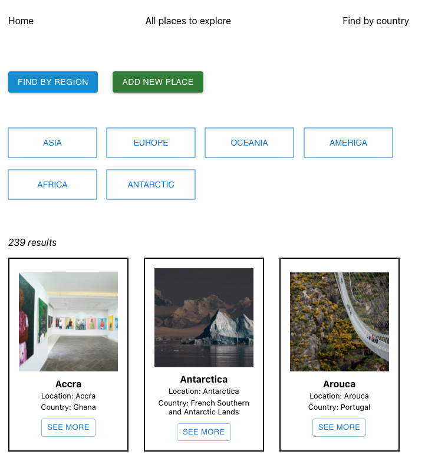
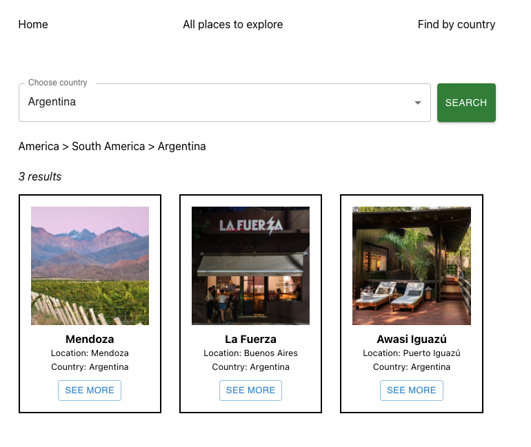
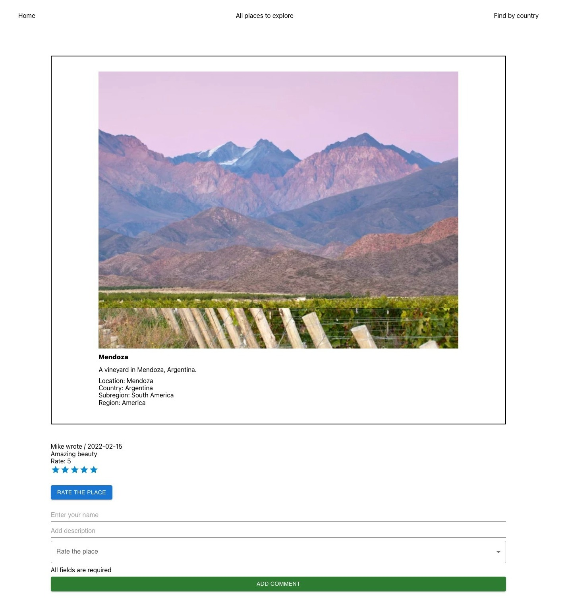
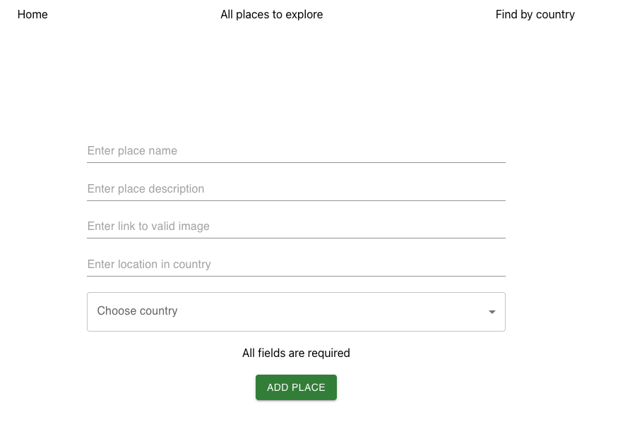
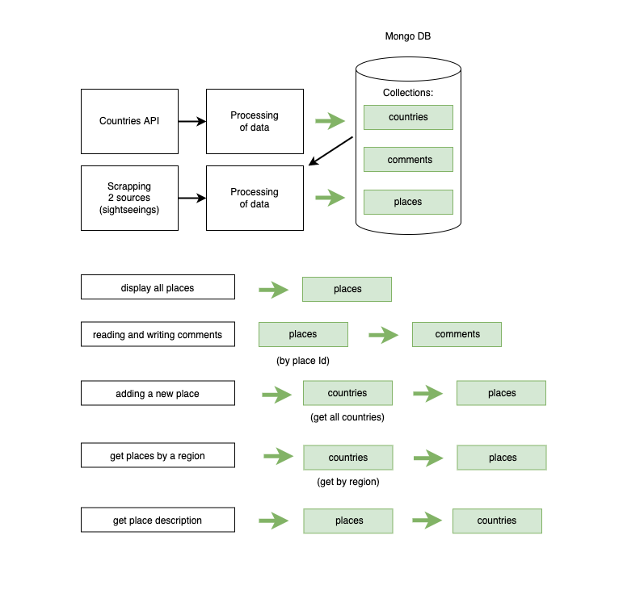

## Places Projects

# About

Project with world's sightseeings where people can share experience of their travelling in different countries by adding new places and searching and leaving comments for existing ones.
The application was created with 236 places (with scrapping) that makes this application ready for users from the beginning.
Due to such functuanality users create content one for another.

[MERN Project Places](http://world-places-project.herokuapp.com/ "MERN Project Places")

# Technologies

- Scrapping
- CSS/HTML
- React.js
- Material UI
- Node.js
- Express.js
- MongoDB

# Functionality

- **Searching for all places, places by region, places by country**
  - **Search by regions**
    
  - **Places by country**
    
- **Commenting existing places**
  
- **Adding new places**
  

# Data flow

# Acknowledgement

- [Rest Countries API](https://restcountries.com/)
- [Scrapper Puppeteer](https://github.com/puppeteer/puppeteer)
